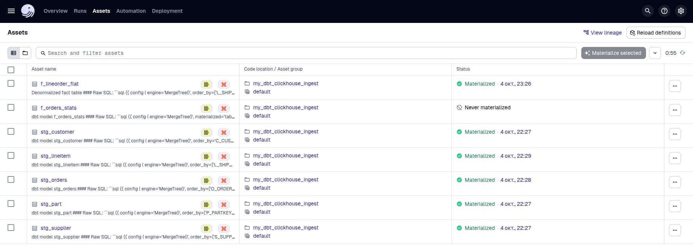

# Инструкция:

ссылка на полезные материалы: https://courses.dagster.io/courses/dagster-essentials



## Подготовка

### Установка библиотек и создание виртуальных окружений

При работе на реальном рабочем компьютере не забыть создать и активировать venv для проекта dbt и для проекта dagster отдельно

Также понадобятся глобальные библиотеки:
- dagster 
- dagit

В venv проекта dagster устанавливаем:
- dagster-dbt
- dbt-core
- dbt-postgres (dbt-clickhouse, ...)

##### Обратите внимание:

Версия dbt-* должна быть совместима с версией dagster-dbt!

### Склонировать репозиторий с dbt проектом

Например:
```shell
git clone https://github.com/DWH-course-examples/dbt_clickhouse_lab.git
```

## Интеграция dbt с dagster

- Создаем пустую директорию
- По желанию можно сгенерировать заглушку для dagster проекта:
```shell
 dagster project scaffold --name my-project
```
- Генерируем dagster проект на основе проекта dbt
```shell
 dagster-dbt project scaffold --dbt-project-dir /app/dbt_clickhouse_lab --project-name my_dbt_clickhouse_ingest --ignore-package-conflict
```
- Запускаем dagster:
```shell
 dagster dev
```

##### Обратите внимание:

При запуске в контейнере или на VM нужна переменная окружения `DAGSTER_WEBSERVER_HOST=0.0.0.0`

или
```shell
dagster dev --host 0.0.0.0
```

- После запуска исследуем asset-ы, запускаем материализацию